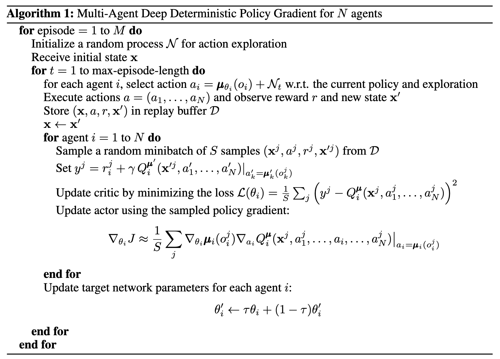
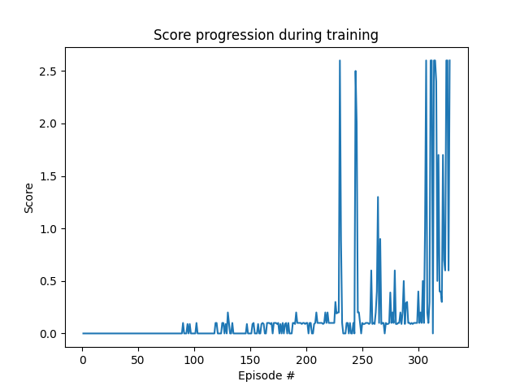

# Tennis Project Udacity DRLND Nanodegree
The goal of the tennis project is to train two tennis playing agents to use
the racket to keep the ball of the ground and pass it over the net, to the opponent's side.
If an agent lets a ball hit the ground or hits the ball out of bounds, it receives a reward of -0.01
while a reward of +0.1 is given when the agent passes the ball over the net.

## 1. Learning Algorithm used
To solve the Tennis environment I used the Multi Agent Deep Deterministic Policy Gradient Algorithm (MADDPG) which is
an extension of the DDPG algorithm to train more than one agent that have their own local
observations but their movement is controlled by a central, common policy. The pseudocode for this algorithm was found in
[this paper](https://arxiv.org/pdf/1706.02275v4.pdf), as follows:



### Environment details
This implementation concearns the unity tennis environment with 2 agents. Two continuous actions are available, corresponding to movement toward (or away from) the net, and jumping.
This environment is responsible for providing the state, reward, next state and done flag once the episode is completed. 
Here, the characteristics of the environment are as follows:
- **State Size**: 24
- **Action Size**: 2
  - Action value between: [-1, 1]
- **Number of Agents**: 2

### DNN designs used for DDPG
Both actor and critic DNNs are fully connected networks with the same number of layers but 
different sizes for the hidden layers. These designs are as follows:
- **Actor DNN**
  - Input Layer: 24 x 512 (+BatchNorm)
  - Hidden Layer: 512 x 256 (+BatchNorm)
  - Output Layer: 256 x 2
  - Activation Function (all layers): *Scaled Exponential Linear Unit (SeLU)* except last one: *tanh*
- **Critic DNN**
  - Input Layer: 24 x 512  (+BatchNorm)
  - Hidden Layer 1: 512 x 256 
  - Hidden Layer 2: 256 x 64
  - Output Layer: 64 x 2
  - Activation Function (all layers): *Scaled Exponential Linear Unit (SeLU)*
  
The optimizer used for training the DNNs is Adam with a learninng rate of 0.001 for the Critic and 0.0001 for the Actor DNN.

### Agent Training
As previously observed in projects solved with DDPG, there is a risk of unstable training. This means that 
even though the score might seem to improve for the initial episodes, there is a high chance of crashing after
several attempts. In order to tackle this issue, we chose not to train the agents at each timestep, but wait 
for some timesteps to pass and then apply training multiple times. For this project I chose to update 
the agents every 5 timesteps and train them 4 separate times.

Given that this is a multi-agent task, I have created a Multi-agent DDPG class to manage both DDPG agents. Specifically,
- it gathers the actions of both agents to send to the unity evironment, and more importantly
- it manages the replay buffer so that experiences from both agents can be stored there and is consequently 
responsible for their training. This guarantees that both agents contribute and learn from a single buffer.

To train each agent's Critic and Actor DNNs we take the following steps:

##### CRITIC TRAINING
1. Retrieve a *BATCH_SIZE* number of <S,A,R,S'> tuples randomly from the replay buffer
2. Get ACTOR_TARGET response to S' (NEXT_ACTIONS)
3. Get CRITIC_TARGET response to S' and NEXT_ACTIONS (Q_TARGET_NEXT)
4. Calculate Q_TARGET using Q_TARGET_NEXT as follows:
```
Q_TARGET = R+ gamma * Q_TARGET_NEXT
```

5. Get CRITIC_LOCAL response given S and A. (Q_EXPECTED)
6. Calculate the error between Q_EXPECTED and Q_TARGET
7. **TRAIN** the CRITIC_LOCAL by backpropagating this error.

####ACTOR TRAINING

- Get ACTOR_LOCAL response given S (ACTIONS)
- Get CRITIC_LOCAL response given S and ACTIONS (ADVANTAGE)
- **TRAIN** the ACTOR_LOCAL based on the minimization of the negative of the ADANTAGE. Thus, 
  performing gradient ascent.


The DDPGAgent and MultiAgentDDPG classes along with the Replay Buffer class are included in the **agent.py** file while the neural network designs used for the actor and the critic
are described in the **model.py** file. To train the agents we use the **train_agent.py** file.

## 2. Results

### Training
Next, we train the agents until the average score of the last 100 episodes is >0.5. It is important to note that the score 
kept at each episode, is the maximum value between the scores achieved by both agents. The score and average score progression during training can be seen 
in the figure below.



The agent was able to solve the environment in 328 episodes (94.34 minutes)!

### Evaluating
As a next step, we evaluate the performance of our trained agents. We test the score over 100 episodes:


As we can see in the figure above, the average score over 100 episodes is 2.02, much higher than 0.5!

### Video Demonstration of trained agents


## 3. Future work
- Solve the Soccer environment.
- Solve the environment with D4PG.
- Experiment with different hyperparameter tuning to see if a smaller size DNN could give similar
results in a relatively faster training time.
